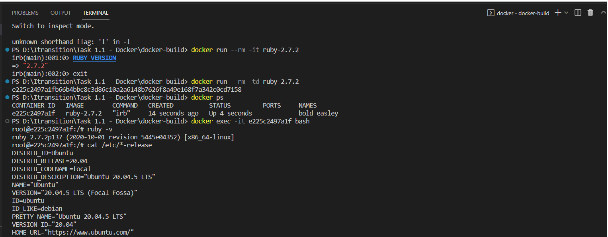

## Ngnix
```
docker run -p 8888:80 nginx

```
<br>
<br>

## Mysql
```
docker volume create mysql_config 
docker volume create mysql

docker run --name mysqldb -d -rm \
-p 3306:3306 \
-e MYSQL_ROOT_PASSWORD=p@ssw0rd1 \
-v mysql:/var/lib/mysql \
-v mysql_config:/etc/mysql \
mysql

docker exec -it <container_id> mysql -p;
mysql > CREATE DATABASE Itransition_course;
mysql > CREATE USER 'user'@'localhost' IDENTIFIED BY 'p@ssw0rd2';
mysql> GRANT ALL PRIVILEGES ON Itransition_course.* TO 'user'@'localhost';
mysql> SHOW GRANTS FOR 'user'@'localhost';
+----------------------------------------------------------------------+
| Grants for user@localhost                                            |
+----------------------------------------------------------------------+
| GRANT USAGE ON *.* TO `user`@`localhost`                             |
| GRANT ALL PRIVILEGES ON `Itransition_course`.* TO `user`@`localhost` |
+----------------------------------------------------------------------+

mysql> show databases;
+--------------------+
| Database           |
+--------------------+
| Itransition_course |
| information_schema |
| mysql              |
| performance_schema |
| sys                |
+--------------------+

```
<br>
<br>

## Работа с Dockerfile
```
docker build -t ruby-2.7.2:latest .
docker run -td ruby-2.7.2
docker exec -it <cintauner_id> bash

```
<br>

##  Работа с Docker Compose
```
docker-compose up -d
docker-compose -f .\docker-compose.yml up -d

```
<br>