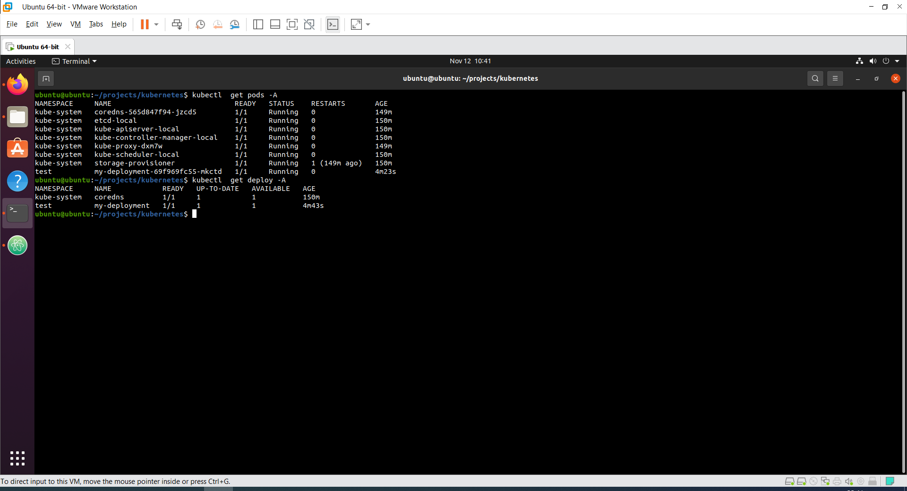
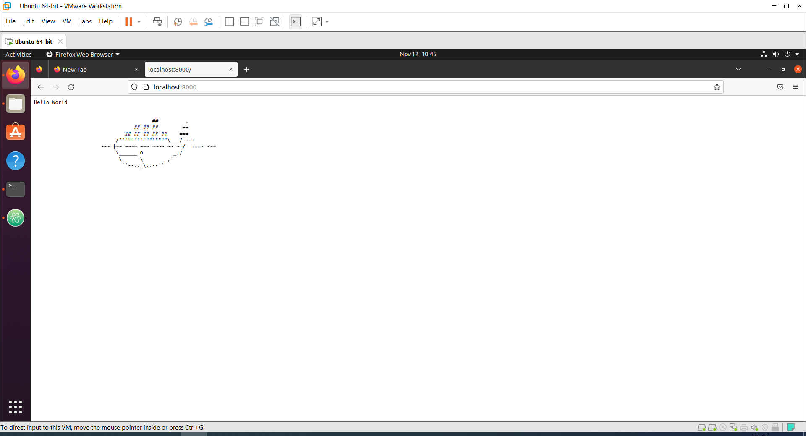
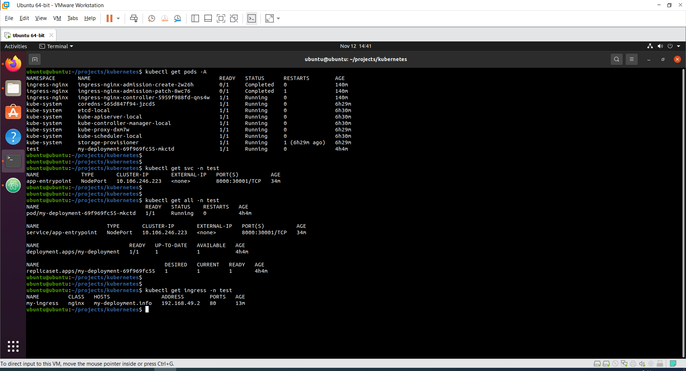
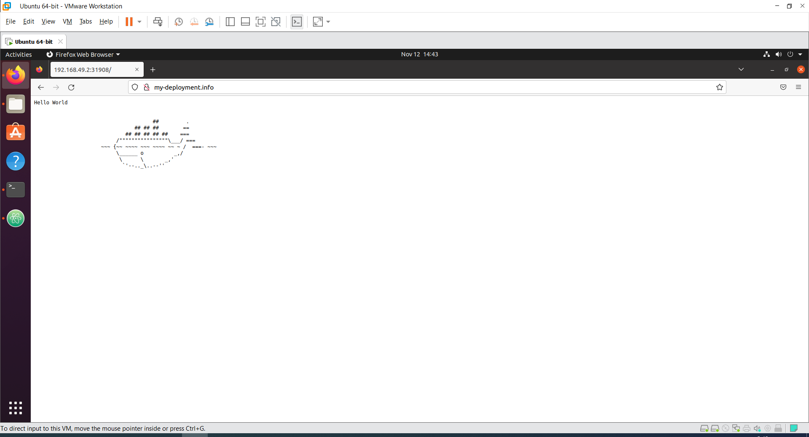

## Mnikube
```
# Install minikube & kubectl
minikube version
kubectl version --client --short
minikube start --cpus=2 --memory=4gb --disk-size=20gb -p local

# Show host and services address
ubuntu@ubuntu:~/projects/kubernetes$ kubectl cluster-info 
Kubernetes control plane is running at https://192.168.49.2:8443
CoreDNS is running at https://192.168.49.2:8443/api/v1/namespaces/kube-system/services/kube-dns:dns/proxy

ubuntu@ubuntu:~/projects/kubernetes$ minikube profile list
|---------|-----------|---------|--------------|------|---------|---------|-------|--------|
| Profile | VM Driver | Runtime |      IP      | Port | Version | Status  | Nodes | Active |
|---------|-----------|---------|--------------|------|---------|---------|-------|--------|
| local   | docker    | docker  | 192.168.49.2 | 8443 | v1.25.3 | Running |     1 |        |
|---------|-----------|---------|--------------|------|---------|---------|-------|--------|

```

## Namespace
```
# Create namespace
kubectl create namespace test
kubectl apply -f ns-test.yaml


# Show namespaces
ubuntu@ubuntu:~/projects/kubernetes$ kubectl get namespaces --show-labels
NAME              STATUS   AGE    LABELS
default           Active   109m   kubernetes.io/metadata.name=default
kube-node-lease   Active   109m   kubernetes.io/metadata.name=kube-node-lease
kube-public       Active   109m   kubernetes.io/metadata.name=kube-public
kube-system       Active   109m   kubernetes.io/metadata.name=kube-system
test              Active   104m   kubernetes.io/metadata.name=test,name=test


```

## Deployment
```
# Set local docker repositiry (before building container or put eval to .profile)
minikube docker-env -p local
eval $(minikube -p local docker-env)

# Create docker container
git clone https://github.com/crccheck/docker-hello-world.git
docker build -t simple-web-app:version3 .

# show api versions
kubectl api-resources --namespaced=true 

# Deploying app
kubectl apply -f deployment.yaml

# Checkout the results
kubectl get pods -A (or -n test)
kubectl get deploy -A (or -n test)

# Chekout the web 
kubectl port-forward my-deployment-69f969fc55-mkctd 8000:8000 -n test 

# Or
kubectl expose deployment -n test my-deployment --type=NodePort --port=8000 
kubectl get service my-deployment -n test

ubuntu@ubuntu:~/projects/kubernetes$ minikube service -n test my-deployment -p local --url
http://192.168.49.2:31705

```
<br>
<br>

## Ingress контроллер
```
# Enable the Ingress controlle
minikube addons enable ingress -p local

kubectl get pods -n ingress-nginx
NAME                                        READY   STATUS      RESTARTS   AGE
ingress-nginx-admission-create-2w26h        0/1     Completed   0          9m39s
ingress-nginx-admission-patch-8wc76         0/1     Completed   1          9m39s
ingress-nginx-controller-5959f988fd-qns4w   1/1     Running     0          9m39s

```

## Ingress rule
```
# Create service (NodePort)
kubectl apply -f deployment.yaml

# Create ingress rule
kubectl apply -f ingress.yaml

# Get results
kubectl get ingress -n test
kubectl get svc -n test
kubectl get pods -n A
kubectl get all -n test

# Add ingress address to /etc/hosts
sudo nano /etc/hosts
192.168.49.2  my-deployment.info  

ubuntu@ubuntu:~/projects/kubernetes$ curl my-deployment.info
<pre>
Hello World


                                       ##         .
                                 ## ## ##        ==
                              ## ## ## ## ##    ===
                           /""""""""""""""""\___/ ===
                      ~~~ {~~ ~~~~ ~~~ ~~~~ ~~ ~ /  ===- ~~~
                           \______ o          _,/
                            \      \       _,'
                             `'--.._\..--''
</pre>

```
<br>
<br>