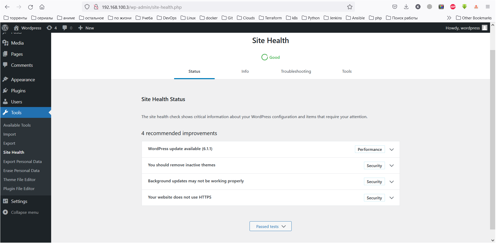
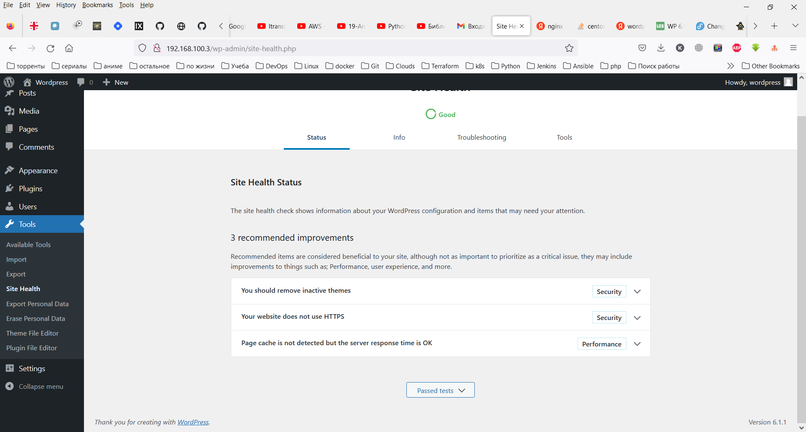

## Troubleshoot linux box

vagrant init
```
vagrant init TimeS-Dev/centos7wpse --box-version 0.0.1
vagrant up

```

Connect to server (from init directory)
```
vagrant ssh 

```

Checkout the logs for ngnix
```
- no new errors

```

Chekout the wordpress health status (with port forwarding from VirtualBox) http://127.0.0.1:22080/wp-admin/
```

4 critical issues
   - One or more required modules are missing
   - Background updates are not working as expected
   - Your site could not complete a loopback request
   - The REST API encountered an error

```

1. Chekout required modules (The required module, gd, is not installed, or has been disabled)
```
yum -y install php-gd --enablerepo=remi,remi-php74
yum -y install php-dom --enablerepo=remi,remi-php74
yum -y install php-imagick --enablerepo=remi,remi-php74
yum -y install php-mbstring --enablerepo=remi,remi-php74
yum -y install php-zip --enablerepo=remi,remi-php74
yum -y install php-intl --enablerepo=remi,remi-php74

systemctl restart php-fpm 
systemctl restart nginx

```

2. Chekout Background updates are not working as expected (Some files are not writable by WordPress)
```
-rw-r--r--.  1 nginx nginx   405 Feb  6  2020 index.php
-rw-r--r--.  1 nginx nginx 19915 Jan  1  2022 license.txt       
-rw-r--r--.  1 nginx nginx  7437 Dec 28  2021 readme.html       
-rw-r--r--.  1 nginx nginx  7165 Jan 21  2021 wp-activate.php   
drwxr-xr-x.  9 nginx nginx  4096 Apr  5  2022 wp-admin
-rw-r--r--.  1 nginx nginx   351 Feb  6  2020 wp-blog-header.php
-rw-r--r--.  1 nginx nginx  2338 Nov  9  2021 wp-comments-post.php
-rw-rw-rw-.  1 nginx nginx  3288 Apr 21  2022 wp-config.php
-rw-r--r--.  1 nginx nginx  3001 Dec 14  2021 wp-config-sample.php
drwxr-xr-x.  6 nginx nginx    82 Nov 16 14:06 wp-content
-rw-r--r--.  1 nginx nginx  3939 Aug  3  2021 wp-cron.php
drwxr-xr-x. 26 nginx nginx 12288 Apr  5  2022 wp-includes
-rw-r--r--.  1 nginx nginx  2496 Feb  6  2020 wp-links-opml.php
-rw-r--r--.  1 nginx nginx  3900 May 15  2021 wp-load.php
-rw-r--r--.  1 nginx nginx 47916 Jan  4  2022 wp-login.php
-rw-r--r--.  1 nginx nginx  8582 Sep 22  2021 wp-mail.php
-rw-r--r--.  1 nginx nginx 23025 Nov 30  2021 wp-settings.php
-rw-r--r--.  1 nginx nginx 31959 Oct 25  2021 wp-signup.php
-rw-r--r--.  1 nginx nginx  4747 Oct  8  2020 wp-trackback.php
-rw-r--r--.  1 nginx nginx  3236 Jun  8  2020 xmlrpc.php

[root@localhost test.site]# ps -ef | grep nginx | head
root       970     1  0 18:06 ?        00:00:00 nginx: master process /usr/sbin/nginx
nginx      972   970  0 18:06 ?        00:00:00 nginx: worker process
nginx     1004   902  0 18:06 ?        00:00:04 php-fpm: pool www
nginx     1005   902  0 18:06 ?        00:00:04 php-fpm: pool www
nginx     1006   902  0 18:06 ?        00:00:03 php-fpm: pool www
nginx     1007   902  0 18:06 ?        00:00:03 php-fpm: pool www
nginx     1008   902  0 18:06 ?        00:00:03 php-fpm: pool www
nginx     1562   902  0 18:07 ?        00:00:03 php-fpm: pool www
nginx     4009   902  0 18:12 ?        00:00:03 php-fpm: pool www
nginx     4766   902  0 18:14 ?        00:00:01 php-fpm: pool www
[root@localhost test.site]# ps -ef | grep php-fpm | head
root       902     1  0 18:06 ?        00:00:00 php-fpm: master process (/etc/php-fpm.conf)
nginx     1004   902  0 18:06 ?        00:00:04 php-fpm: pool www
nginx     1005   902  0 18:06 ?        00:00:04 php-fpm: pool www
nginx     1006   902  0 18:06 ?        00:00:03 php-fpm: pool www
nginx     1007   902  0 18:06 ?        00:00:03 php-fpm: pool www
nginx     1008   902  0 18:06 ?        00:00:03 php-fpm: pool www
nginx     1562   902  0 18:07 ?        00:00:03 php-fpm: pool www
nginx     4009   902  0 18:12 ?        00:00:03 php-fpm: pool www
nginx     4766   902  0 18:14 ?        00:00:01 php-fpm: pool www
root     18800  1259  0 18:36 pts/0    00:00:00 grep --color=auto php-fpm

# Checkout /etc/php-fpm.d/www.conf File settings
user=nginx
group=nginx

# Checkout /etc/selinux/config File (SELINUX=enforcing)
setenforce Permissive

```

3. Resolving the problems "Your site could not complete a loopback request & The REST API encountered an error"
```
# Change Virtual Box network connection to Bridge
# Change wordpress DB parameters to have access to the site

    UPDATE `wordpress`.`wp_options` SET `option_value` = 'http://192.168.100.3' WHERE (`option_id` = '1');
    UPDATE `wordpress`.`wp_options` SET `option_value` = 'http://192.168.100.3' WHERE (`option_id` = '2');

```

<br>

4. Updating the Wordpress to the last version 6.1.1

<br>