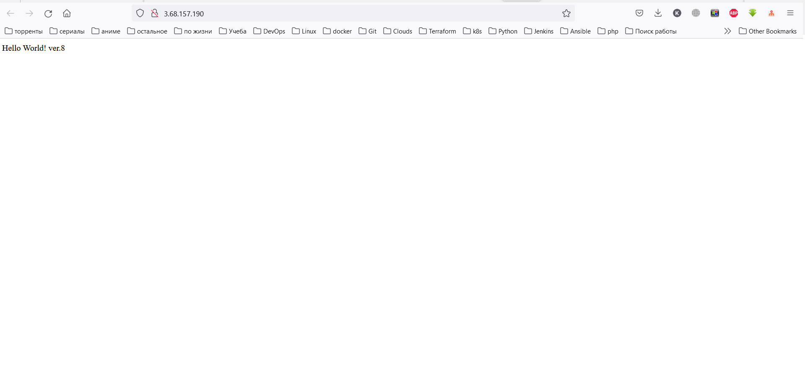
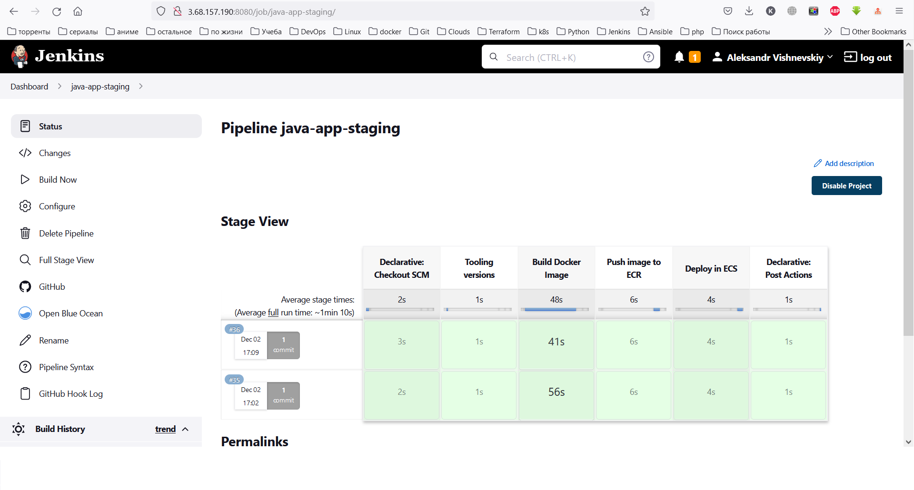
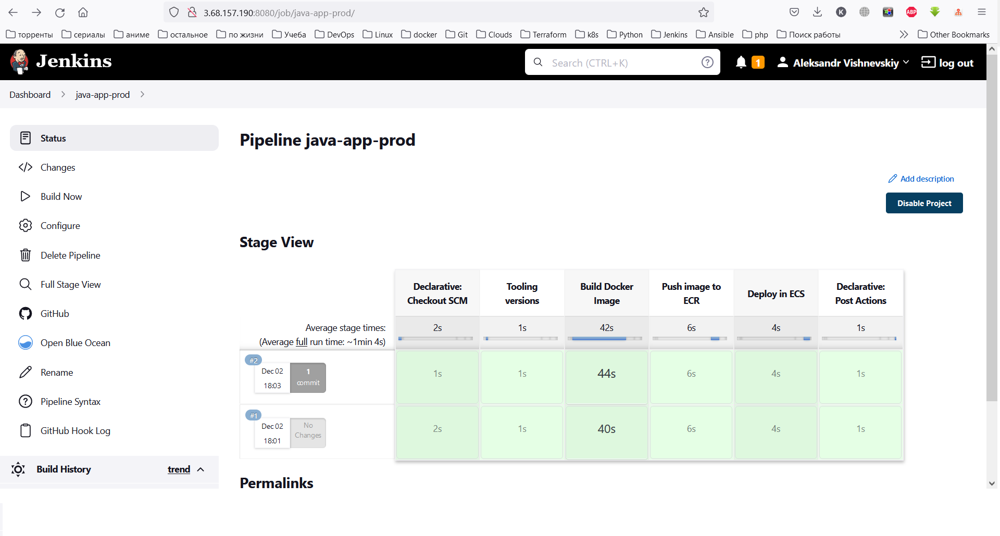

## Jenkins
Customize Jenkins docker image
```
docker build -t vishnevskiyav/myjenkins-blueocean:2.361.4-3 .
docker push vishnevskiyav/myjenkins-blueocean:2.361.4-3
```

Use automatic deployment of Jenkins docker image to AWS ECS environment.
./terraform-ecs-jenkins

```
terraform init
terraform plan
terraform apply

```
Connect to ECS EC2 instance to pull logs from Jenkins container to get administrator key

```
docker logs <conteiner_id>

```
I use EFS volume to attach to Jenkins conteiner to store all settings (it must be created independently of this template)
Also we use docker.sock from the host EC2 instance (it's not safe, but for this task it's ok)

## Project

Jenkins plugins:

```
Pipeline Utility Steps Plugin
Pipeline AWS Steps Plugin
Docker Pipeline Plugin
CloudBees AWS Credentials Plugin

```

```
# Using Java project with docker build and deploying to AWS ECS with AWS cli commands. When deployed it will be "Hello world" string in the browser. 

https://github.com/VishnevskiyAV/java-app.git

# Jenkins files with pipelines inside the project
# To connect to Git Repository we use SSH autentification
# There are two branches main and staging
# The artifact is docker container it stores in AWS ECR (connection via AWS credentials), in earlier versions artifacts stored in DockerHub (connection via username and token)

```

## Deploying and updating a project
```
# Project deployment implemented with updateting task definition and force deployment of service

/usr/local/bin/aws ecs register-task-definition --region ${AWS_ECR_REGION} --family ${AWS_ECS_TASK_DEFINITION} --execution-role-arn ${AWS_ECS_EXECUTION_ROL} --requires-compatibilities ${AWS_ECS_COMPATIBILITY}  --cpu ${AWS_ECS_CPU} --memory ${AWS_ECS_MEMORY} --container-definitions file://${AWS_ECS_TASK_DEFINITION_PATH}"

sh("/usr/local/bin/aws ecs update-service --cluster ${AWS_ECS_CLUSTER} --service ${AWS_ECS_SERVICE} --task-definition ${AWS_ECS_TASK_DEFINITION} --force-new-deployment")

# Triggering new jobs
On staging push event trigger the webhook
On prod Pull requests event trigger the webhook

```
<br>
<br>

```
Jenkins pipelines for prod and staging
```
<br>
<br>
