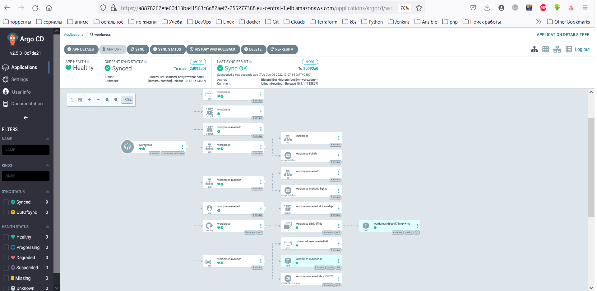
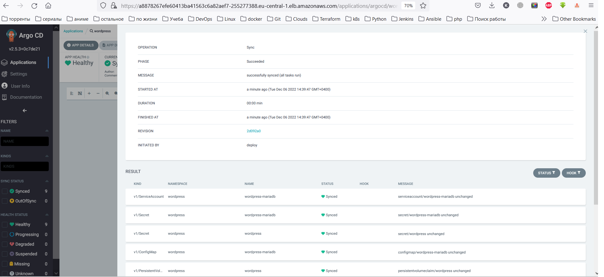

## ArgoCD

[Project git repo](https://github.com/VishnevskiyAV/charts)

```
# Create cluster and deploy ArgoCD
eksctl create cluster -f config.yaml 
kubectl create namespace argocd
kubectl apply -n argocd -f https://raw.githubusercontent.com/argoproj/argo-cd/stable/manifests/install.yaml

```

```
# Checkout ArgoCD services
NAME                                      TYPE        CLUSTER-IP       EXTERNAL-IP   PORT(S)                      AGE
argocd-applicationset-controller          ClusterIP   10.100.103.174   <none>        7000/TCP,8080/TCP            16m
argocd-dex-server                         ClusterIP   10.100.32.91     <none>        5556/TCP,5557/TCP,5558/TCP   16m
argocd-metrics                            ClusterIP   10.100.89.199    <none>        8082/TCP                     16m
argocd-notifications-controller-metrics   ClusterIP   10.100.162.246   <none>        9001/TCP                     16m
argocd-redis                              ClusterIP   10.100.232.180   <none>        6379/TCP                     16m
argocd-repo-server                        ClusterIP   10.100.80.248    <none>        8081/TCP,8084/TCP            16m
argocd-server                             ClusterIP   10.100.196.62    <none>        80/TCP,443/TCP               16m
argocd-server-metrics                     ClusterIP   10.100.210.94    <none>        8083/TCP                     16m

```
```
# Install ArgoCD CLI
$version = (Invoke-RestMethod https://api.github.com/repos/argoproj/argo-cd/releases/latest).tag_name
$url = "https://github.com/argoproj/argo-cd/releases/download/" + $version + "/argocd-windows-amd64.exe"
$output = "argocd.exe"
Invoke-WebRequest -Uri $url -OutFile $output

```
```
# Access The Argo CD API Server (from Linux)
kubectl patch svc argocd-server -n argocd -p '{"spec": {"type": "LoadBalancer"}}'
# or
kubectl port-forward svc/argocd-server -n argocd 8080:443

# Get ArgoCD Password (from Linux)
kubectl -n argocd get secret argocd-initial-admin-secret -o jsonpath="{.data.password}"
argocd login <ARGOCD_SERVER>
argocd account update-password

```

```
# Deploy Wordpress
Create Git repository in settings ArgoCD (Settings\Repositories)
Create Application with parameters: 
  wordpressUsername=admin 
  wordpressPassword=password 
  mariadb.auth.rootPassword=secretpassword  

# Configure Auto-sync
argocd app set <APPNAME> --sync-policy automated

```

## ArgoCD configure
```
# Login ArgoCD via console
argocd login a8878267efe60413ba41563c6a82aef7-255277388.eu-central-1.elb.amazonaws.com --grpc-web

# Create new user
## New users should be defined in argocd-cm ConfigMap

kubectl edit cm argocd-cm -n argocd

# Edit ConfigMap:
apiVersion: v1
data:
  accounts.deploy: apiKey, login
#  accounts.deploy.enabled: "false"
kind: ConfigMap
metadata:
  annotations:
    kubectl.kubernetes.io/last-applied-configuration: |
      {"apiVersion":"v1","kind":"ConfigMap","metadata":{"annotations":{},"labels":{"app.kubernetes.io/name":"argocd-cm","app.kubernetes.io/part-of":"argocd"},"name":"argocd-cm","namespace":"argocd"}}
  creationTimestamp: "2022-12-04T09:57:50Z"
  labels:
    app.kubernetes.io/name: argocd-cm
    app.kubernetes.io/part-of: argocd
  name: argocd-cm
  namespace: argocd
  resourceVersion: "539835"
  uid: e18ed019-3646-4721-9e05-76658b955bea

# Chekout ArgoCD Users

argocd account get --account <username>

argocd account list

NAME    ENABLED  CAPABILITIES
admin   true     login
deploy  true     apiKey, login

# Set password to new user
# if you are managing users as the admin user, <current-user-password> should be the current admin password.
argocd account update-password \
  --account <name> \
  --current-password <current-user-password> \
  --new-password <new-user-password> 

# Edit ConfigMap for rbac 

kubectl edit cm argocd-rbac-cm -n argocd

apiVersion: v1
data:
  policy.csv: |
    p, role:test-role, applications, *, default/*, allow
    g, deploy, role:test-role
  policy.default: role:''

```
<br>
<br>

