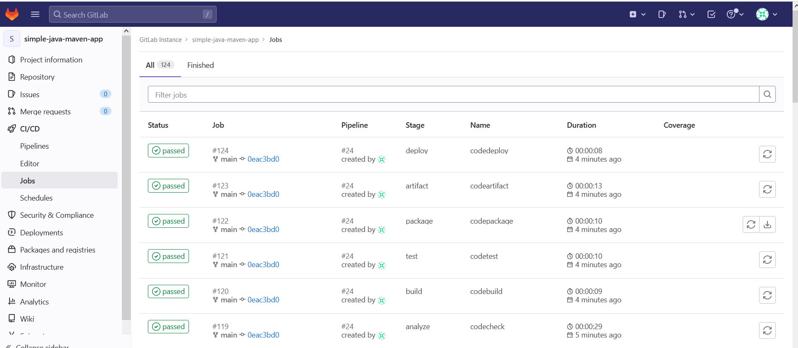
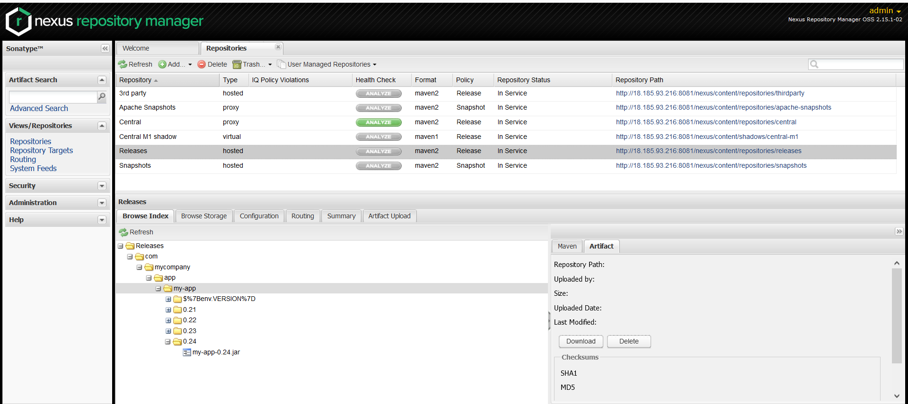
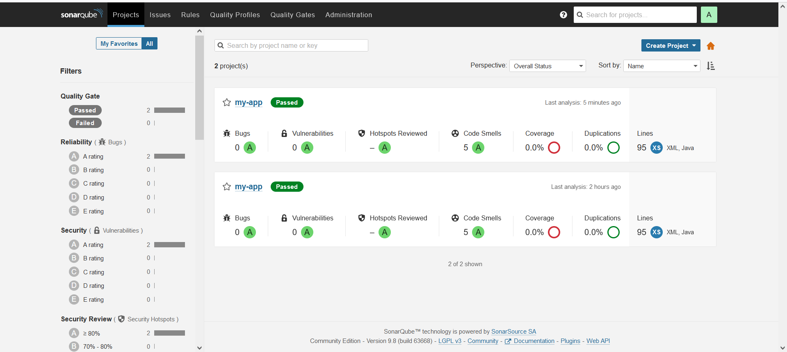
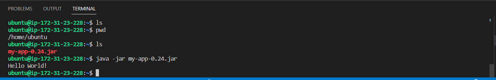

# GitLab Full lifecycle

[Java repo](https://github.com/VishnevskiyAV/simple-java-maven-app/tree/dev)

## Creating the infrastructure: GitLab + Nexus + Sonarqube + GitLab Runner + APP Server

Path ./terraform-infra

```
terraform init
terraform plan
terraform apply 
```

Get temporary password for GitLab (default username: root)

```
docker exec -it gitlab grep 'Password:' /etc/gitlab/initial_root_password
```

Register the runner on GitLab (copy registration-token from GitLab server)

```
# Register runner
docker exec gitlab-runner \
    gitlab-runner register \
    --non-interactive \
    --url http://gitlab.example.com/ \
    --registration-token <TOKEN> \
    --executor docker \
    --description "Runner 1" \
    --docker-image "docker:stable" 

# Some issue with repository access when jobs starting, so we need to add extra line to /etc/git-runner/config.toml 
(clone_url = "http://<external_address>" and extra_hosts = ["gitlab.example.com:<external_address>"])

[[runners]]
  name = "Sample Runner 1"
  url = "http://gitlab.example.com/"
  id = 6
  token = "16-iZ2uwLVLdGHy_5gV6"
  token_obtained_at = 2023-01-02T13:00:09Z
  token_expires_at = 0001-01-01T00:00:00Z
  executor = "docker"
  clone_url = "http://<external_address>"
  [runners.custom_build_dir]
  [runners.cache]
    MaxUploadedArchiveSize = 0
    [runners.cache.s3]
    [runners.cache.gcs]
    [runners.cache.azure]
  [runners.docker]
    tls_verify = false
    extra_hosts = ["gitlab.example.com:<external_address>"]
    image = "docker:stable"
    privileged = false
    disable_entrypoint_overwrite = false
    oom_kill_disable = false
    disable_cache = false
    volumes = ["/cache"]
    shm_size = 0
```

<br>

Access Nexus and Sonarqube and configure them

```
# Access Nexus
http://<IP_Adress>:8081/nexus/
# admin / admin123

# Access Sonarqube
http://<IP_Adress>:9000
# admin / admin
```

## Nexus configuration

```
# Add variables to CI/CD GitLab for Nexus
Nexus_REPO_URL: http://<IP_Adress>:8081/nexus/content/repositories/
Nexus_REPO_USER: admin
Nexus_REPO_PASS: admin123
```

```
# Add Nexus repository to pom.xml in java-app directory

<distributionManagement>
    <!-- Publish the versioned releases here -->
    <repository>
      <id>nexus</id>
      <name>release</name>
      <url>${env.Nexus_REPO_URL}releases</url>
    </repository>
    <!-- Publish the versioned releases here -->
    <snapshotRepository>
      <id>nexus</id>
      <name>snapshots</name>
      <url>${env.Nexus_REPO_URL}snapshots</url>
    </snapshotRepository>
  </distributionManagement>
```

```
# In the java-app directory create .m2 dir and add settings.xml file (credentials for nexus)

<settings xsi:schemaLocation="http://maven.apache.org/SETTINGS/1.1.0 http://maven.apache.org/xsd/settings-1.1.0.xsd"
          xmlns="http://maven.apache.org/SETTINGS/1.1.0" xmlns:xsi="http://www.w3.org/2001/XMLSchema-instance">
    <servers>
        <server>
            <id>nexus</id>
            <username>${env.Nexus_REPO_USER}</username>
            <password>${env.Nexus_REPO_PASS}</password>
        </server>
    </servers>
</settings>
```
<br>

## Sonarqube configuration
```
# Add variables to CI/CD GitLab for Sonarqube
SONAR_HOST_URL : <http://<IP_Adress>:9000
SONAR_TOKEN: <TOKEN>

# Add project to Sonarqube server by choosing GitLab on the welcome screen
Add GitLab token
Add Gitlab Address: <http://<IP_Adress>/api/v4
```
<br>

## Deploy app to server

```
# Add variables to CI/CD GitLab:
SSH: (ssh key as file)

```
<br>


