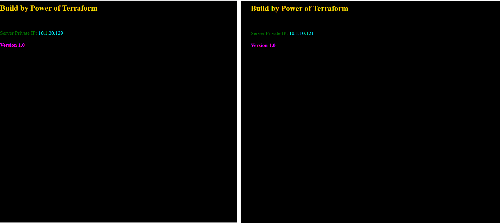
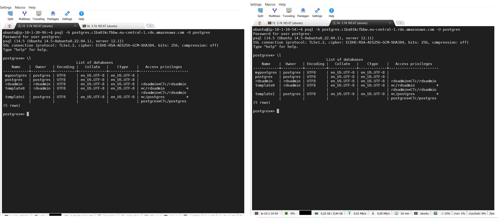
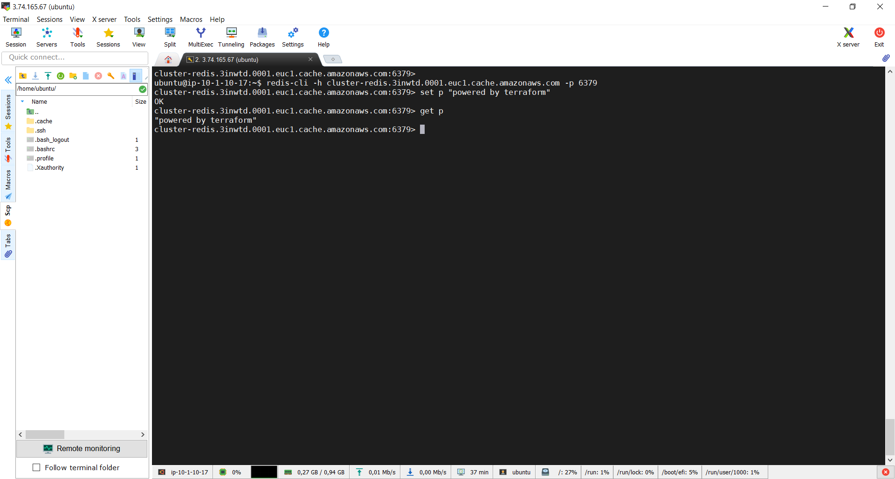
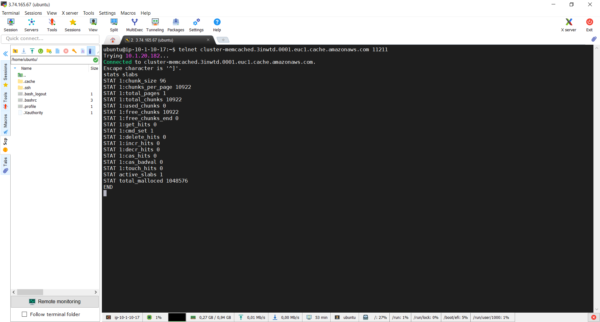
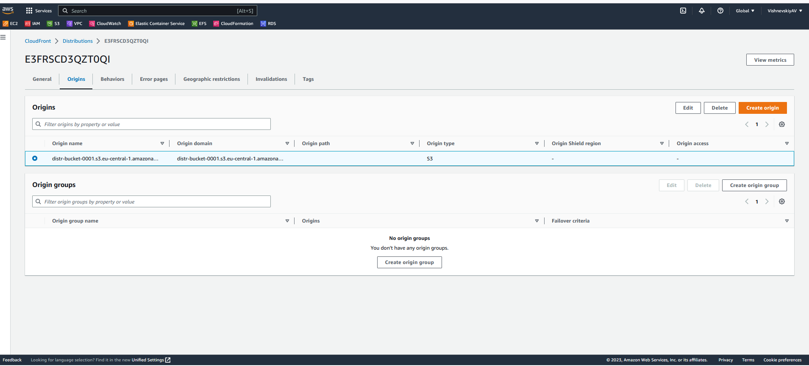
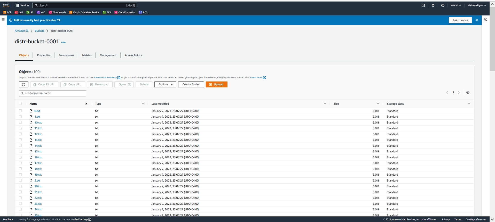
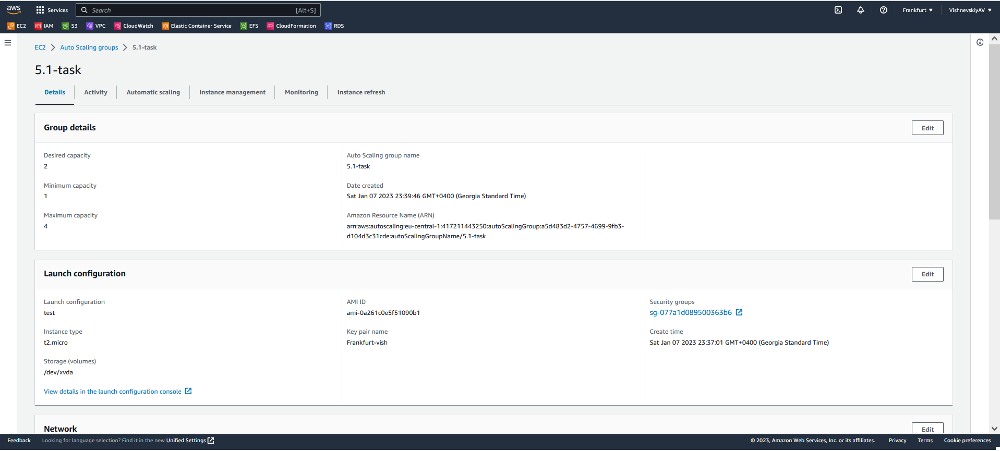
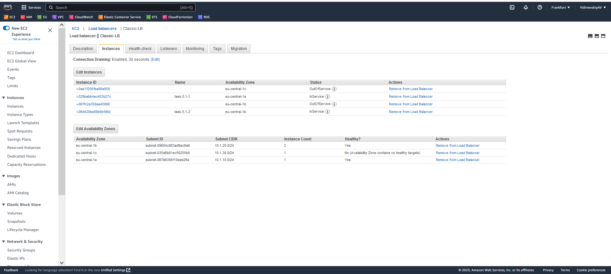

# AWS Fundamentals

All infrustructure created over terraform. There are a collection of modules which creates all nessesary resourses:
1. Network Module (Point 1 of the current task)
2. SG Module (point 2 of the current task) 
3. EC2 Module (point 3-5,10 of the current task)
4. RDS Module (point 6 of the current task)
5. ElastiCache Module (point 7 of the current task)

* The working directory for terraform is /task

* The best practice is to create a public subnet over Internet Gateway and private subnets over NAT Gateway, but NAT Gateway costs money, so we use Network ACL, and the part of network template with private subnets and NAT Gateway is commented.

## Load Balancing over two instances 
<br>

## Postgres connection over two instances 
```bash
psql -h <RDS_address> -U <username>
```
<br>

## ElastiCache (redis)
```bash
redis-cli -h cluster-redis.3inwtd.0001.euc1.cache.amazonaws.com -p 6379
```
<br>

## ElastiCache (memcached)
```bash
telnet <address_of_memcached> 11211
```
<br>

## CloudFront Distribution (point 8 of the current task)

<br>

## S3 Bucket 

```bash
# Create 100 files 
for f in {0..99}
do
    echo hello > "$f.txt"
done

# Copy files to s3 bucket
aws s3 cp /home/ubuntu/1/  s3://distr-bucket-0001 --recursive
```
<br>

Script file
```bash
#!/bin/bash
export BUCKET='s3://distr-bucket-0001'

aws s3 cp $BUCKET /home/ubuntu/2/ --recursive

aws s3 cp /home/ubuntu/1/  $BUCKET --recursive

aws rm $BUCKET --recursive

```

## ASG
I can rewrite the ec2 module into an ASG module, or create a new one, but it's not interesting, I've done this job a several times before

<br>
<br>