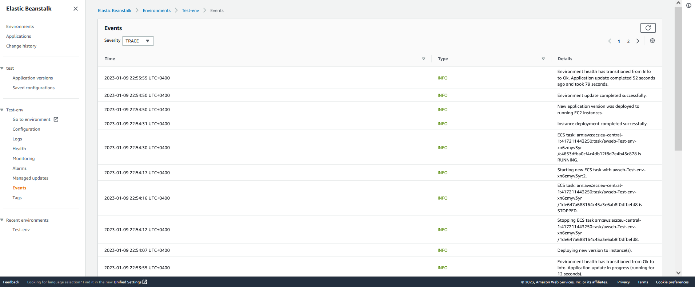

# AWS Elastic Beanstalk

The simple app with nginx as reverse proxy

## Build Docker containers

```bash
./myapp/Dockerfile
./nginx/Dockerfile
```
## Push docker images into the ECR Regestry

```bash
# Get ECR credentials 
aws ecr get-login --region eu-central-1

# Add ECR Credentials to docker 
docker login -u AWS -p <password> https://<AWS_ID>.dkr.ecr.eu-central-1.amazonaws.com

# Create repository in ECR for app and nginx

# Rename the docker image
docker tag app:latest 417211443250.dkr.ecr.eu-central-1.amazonaws.com/app:1.0
docker tag nginx:latest 417211443250.dkr.ecr.eu-central-1.amazonaws.com/nginx:1.0

# Push to ECR
docker push 417211443250.dkr.ecr.eu-central-1.amazonaws.com/app:1.0
docker push 417211443250.dkr.ecr.eu-central-1.amazonaws.com/nginx:1.0
```

## Provisioning beanstalk

Attach the next Policy to you Instance Profile:
- AmazonEC2ContainerRegistryReadOnly 

Create AWS Beanstalk, for Platform, select Docker. For Platform branch, select ECS running on 64bit Amazon Linux 2.

<br>
<br>
<br>

