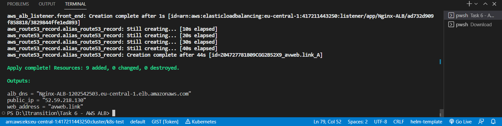
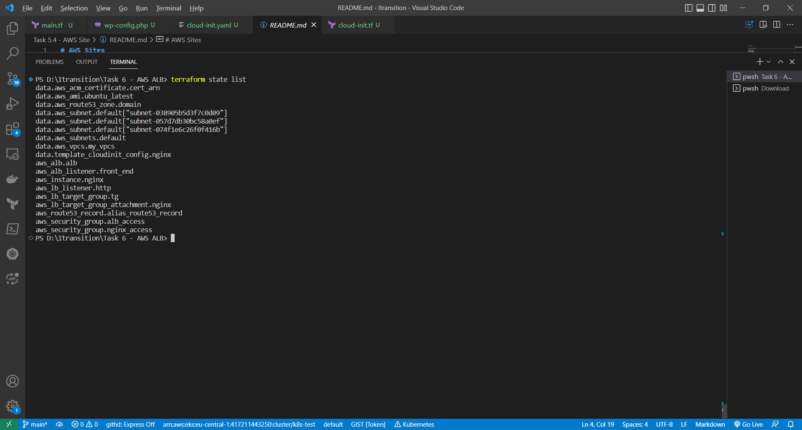
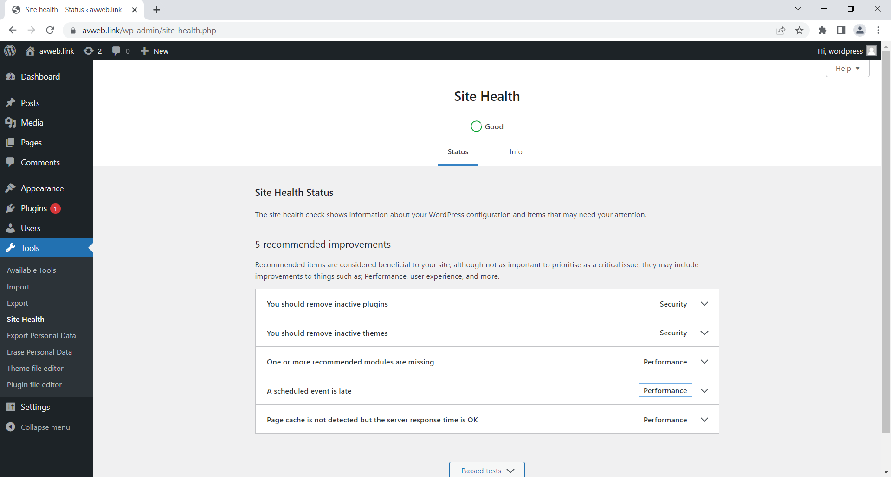

# AWS Woerdpress through an ALB

This template creates a Wordpress site with Nginx. The site runs through an Application Load Balancer tied to the Route53 domain name (avweb.link, www.avweb.link).

## Deploying Terraform templates  


```
terraform init
terraform plan
terraform apply
terraform state list
```
## Results

Resources created
<br>

List of created resources
<br>

Wordpress displayed results

<br>
<br>
